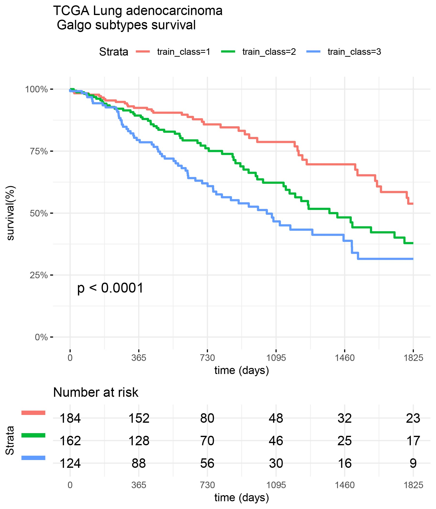

GSgalgoR 
================================================================================
<!-- badges: start -->
[](https://codecov.io/gh/harpomaxx/GSgalgoR?branch=master)
[](https://travis-ci.org/harpomaxx/GSgalgoR)
<!-- badges: end -->

GSgalgoR is a R package implementing a multi-objective optimization algorithm for disease subtype discovery based on a  non-dominated sorting genetic algorithm (galgo). The galgo framework combines the advantages of clustering algorithms for grouping heterogeneous omics data and the searching properties of genetic algorithms for feature selection and optimal number of clusters determination to find features that maximize the survival difference between subtypes while keeping cluster consistency high.

## Citation

GSgalgoR is covered in [*Galgo: A bi-objective evolutionary meta-heuristic identifies robust transcriptomic classifiers associated with patient outcome across multiple cancer types*](https://academic.oup.com/bioinformatics/article-abstract/doi/10.1093/bioinformatics/btaa619/5868557).

Please cite:
> M E Guerrero-Gimenez, J M Fernandez-Muñoz, B J Lang, K M Holton, D R Ciocca, C A Catania, F C M Zoppino, Galgo: A bi-objective evolutionary meta-heuristic identifies robust transcriptomic classifiers associated with patient outcome across multiple cancer types, Bioinformatics, , btaa619, https://doi.org/10.1093/bioinformatics/btaa619

## Documentation

The full documentation of the package is available at https://harpomaxx.github.io/GSgalgoR/

## Package Overview

The **GSgalgoR** package implements the Galgo algorithm as well as several helper functions for analyzing the results. 

In order to standardize the structure of genomic data, the package uses the `ExpressionSet` structure from the **Biobase** package. The `ExpressionSet` objects can hold different types of data in a single structure, but in this case, we opted for using a simplified format to facilitate the example to those not familiar with the *Biobase* package. The *ExpressionSet* objects are formed mainly by a matrix of genetic expression, usually derived from microarray or RNAseq experiments and the Phenotypic data containing information on the samples (condition, status, treatment, survival, and other covariates). Additionally, some annotations and feature Meta-data can also be included in the objects. 

A complete and detailed explanation about galgo's workflow is provided in the 
[example Vignette](https://harpomaxx.github.io/GSgalgoR/articles/GSgalgoR.html)

The package provides a simple but robust callback mechanism to adapt the algorithm to different needs ([check the Vignette](https://harpomaxx.github.io/GSgalgoR/articles/GSgalgoR_callbacks.html)). Additionally, **GSgalgoR** provides the Wilkerson's centroids to perform lung adenocarcinoma sample classification.

# Installation

You can install the released version of GSgalgoR using devtools with:

```
devtools::install_github("https://github.com/harpomaxx/GSgalgoR")
library(GSgalgoR)
```
## Executing Galgo

The main function in the package is `galgo()`. The function accepts an expression matrix in the previous detailed section and a survival object **survival** package) to find robust gene expression signatures related to a given outcome. Besides, `galgo()` accepts several other parameters such as the number of solutions in the population, the number of generations the algorithm must evolve, and the distance function used for the clustering algorithm, among others. The parameters facilitate the setup according to the characteristics of the analysis to be performed. All the Galgo evolutionary process is executed using a multicore architecture. Alternatively, to speed up the process, it is possible to execute Galgo on Graphics processor units (GPU).

For a rapid testing of GSgalgoR two reduced lung adenocarcinoma gene expression datasets ([TCGA] and [GSE68465]) can be downloaded from  https://bit.ly/luad_data_galgo *(md5sum 900a74e7c4fdd0dcb7a3f2ddb44bb680)* .  

An example of a typical GSgalgoR workflow is shown below:

```
download.file("https://bit.ly/luad_data_galgo",destfile="/tmp/luad.rds")
rna_luad <- readRDS("/tmp/luad.rds")

prm <- rna_luad$TCGA$expression_matrix
clinical <-rna_luad$TCGA$pheno_data
OS <- survival::Surv(time=clinical$time,event=clinical$status)

output<-GSgalgoR::galgo(generations = 5, population = 30,
       prob_matrix = prm, OS=OS, ,verbose = 2,usegpu = F)
```   

An example of the results obtained by Galgo in the TCGA dataset. The first plot shows the Pareto front obtained by *GSgalgoR* in terms of the Survival (Surv.Fit) and the cohesiveness (SC.Fit) fitness functions. On the second plots shows the different survival subtypes found by the algorithm.




## GPU support

GSgalgoR is able to fasten its execution using GPU computing utilizing the [gpuR package](https://cran.r-project.org/package=gpuR "gpuR R package") . Before installing [gpuR](https://cran.r-project.org/package=gpuR "gpuR R package"), the opencl backend should be configured. 

In linux systems install latest nvidia cuda drivers and the opencl backend.

```
       apt-get install nvidia-418 nvidia-opencl-icd-418 libcuda1-418
       apt-get install opencl-headers  ocl-icd-opencl-dev
       
```

For installing [gpuR](https://github.com/cdeterman/gpuR/wiki) and enable GPU computing in different operating systems, follow [gpuR installation guide](https://github.com/cdeterman/gpuR/wiki "gpuR installation guide").

# References

* Guerrero-Gimenez ME, Fernandez-Muñoz JM, Lang BJ, Holton KM, Ciocca DR, Catania CA, Zoppino FCM. Galgo: A bi-objective evolutionary meta-heuristic identifies robust transcriptomic classifiers associated with patient outcome across multiple cancer types, Bioinformatics, 2020, btaa619, https://doi.org/10.1093/bioinformatics/btaa619
* Guerrero-Gimenez ME, Catania CA, Fernandez-Muñoz JM et al. Genetic algorithm for the searching cancer subtypes with clinical significance according to their gene expression patterns , 9(ISCB Comm J 2018):664 (poster) (doi: 10.7490/f1000research.1118020.1)
